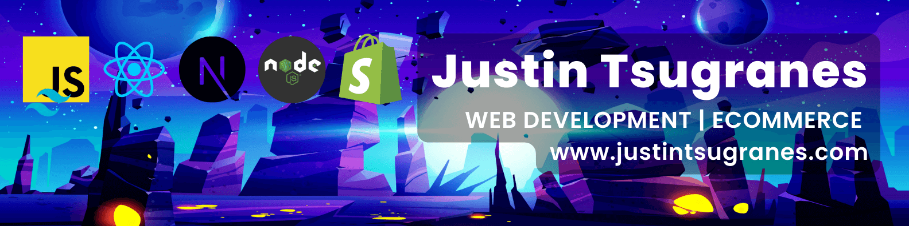

  

  
# Hi, I'm Justin. Welcome to my GitHub
  

  

  
  <!--  -->
  
  

 

 
 
  

---

## About Me

- 🔭 I’m currently working as a Developer @[Cable and Connections](https://cableandconnections.com) on the eCommerce team.

- 🌱 I’m currently working on **Shopify Dev, Headless CMS, and Design Systems.**

- 👨‍💻 All of my projects are available at [https://justintsugranes.com](https://justintsugranes.com)

<!-- - 📝 I regularly write articles on [theLightningRealm](https://lightning-realm.vercel.app) -->

- 💬 Ask me about **React, Next.js, TailwindCSS, Sanity.io, and JAMstack technologies**

- 📫 How to reach me: **justinjontsugranes@gmail.com**

**⚡ Fun facts:**

- Before I began coding full time, I was helping production companies with commercials for the Super Bowl.
- I blew my right hand up with dynamite when I was 9 (no joke... it took 120 stitches to put it back together). I went on to obtain a Master's Degree in Jazz Guitar and then became a guitarist for the US Army and a recording artist. Check out [My Spotify](https://open.spotify.com/artist/4vV18ClJAixgpNfKaJkEmR?si=4ilxbBCFSiKtrI8EqvoGLg).

- 🥅 2023 Goals: Improve my knowledge of writing algorithms and learn how to surf!

**Completely Aside From Tech**

- playing guitar, writing songs, learning how to sail, backgammon, photography, live shows and events, hiking, camping, backpacking, trail-running, road trips, non-fiction books-audiobooks-podcasts-vlogs-blogs, snorkeling, and diving into artistic rabbit holes.

### _Best of Luck and I'll see you in the metaverse!_

---

### Languages

<!--  -->

### Technology Stack

<!--  -->

### Operating System & Tools

<!--  -->

### UX/UI and Graphic Design

<!-- ### Blockchain Love

 -->

---

<!-- ## Medium

Check out all of [Medium](https://medium.com/@justintsugranes) articles. I talk about my journey to learn how to code, Web 3.0 (without all of the FUD and FOMO), music, guitar, and project deep-dives on current and past creative projects.

### Recent Articles -->

<!-- BLOG-POST-LIST:START -->

<!-- - [Personal Rules and Tools For Greatness](https://medium.com/thepathcreator/personal-rules-and-tools-for-greatness-d18e513f6887?source=rss-7a7403f7f237------2)
- [How Fernando Sor Helped Elevate The Guitar’s Status](https://medium.com/itsguitar/how-fernando-sor-helped-elevate-the-guitars-status-548195669b5d?source=rss-7a7403f7f237------2)
- [How To Be A Pro Guitarist](https://medium.com/itsguitar/how-to-be-a-pro-guitarist-d5dc2939c158?source=rss-7a7403f7f237------2)
- [Stage Etiquette For Performing Guitarists](https://medium.com/itsguitar/stage-etiquette-for-performing-guitarists-f32309e18ef0?source=rss-7a7403f7f237------2) -->
<!-- BLOG-POST-LIST:END -->

  
## :fire: GitHub Stats :fire:

&nbsp;

<!-- 

  
Recent GitHub Activity
 -->

<!--START_SECTION:activity-->
<!--END_SECTION:activity-->

<!-- 
 -->

---

  
 
  
## If you like my work, maybe you would like to

